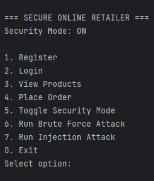
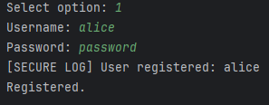
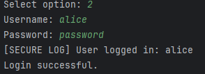
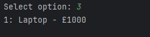
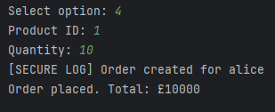
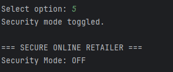
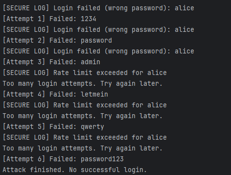
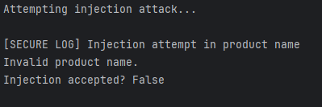
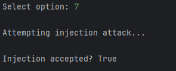

# Secure Online Retailer System

## Overview

This project implements a secure command-line based online retailer system developed in Python. The system demonstrates secure software development principles by allowing security controls to be toggled on and off at runtime.

The application follows the Model–View–Controller (MVC) architecture and uses the Strategy Pattern to dynamically switch between secure and insecure behaviours.

## Features

### Core Functionality

* User registration and authentication
* Product lists
* Order creation (CRUD functionality)
* Session management

### Security Features (Secure Mode ON)

* Input validation (prevents injection attacks)
* Password hashing (SHA-256)
* Rate limiting and account lockout (brute force protection)
* Event logging
* Session token validation

### Insecure Mode (Secure Mode OFF)

* No input validation
* Plain-text password handling
* No rate limiting
* No logging

## Attack Simulations

The system includes built-in demonstrations of:

* Brute Force Attack

  * Blocked in secure mode
  * Successful in insecure mode

* Injection Attack

  * Rejected in secure mode
  * Accepted in insecure mode

* Denial of Service

  * Rate-limited in secure mode
  * Unrestricted in insecure mode

## How to Run

1. Ensure Python is installed
2. Navigate to the project directory
3. Run the application: python main.py

## How to Use

* Register a new user

* Login with credentials

* View available products

* Place orders

* Toggle security mode

* Run attack simulations from the CLI menu

#

#

## Testing

To run tests:

python test_auth.py

python test_products_orders.py

## References 
While the code is original, various sources were used in the gathering of libraries and methods of coding.   

w3Schools (2024). Python Tuples. [online] www.w3schools.com. Available at: https://www.w3schools.com/python/python_tuples.asp.   

docs.python.org. (n.d.). enum — Support for enumerations — Python 3.10.1 documentation. [online] Available at: https://docs.python.org/3/library/enum.html.   

GeeksforGeeks (2020). Python pass Statement. [online] GeeksforGeeks. Available at: https://www.geeksforgeeks.org/python/python-pass-statement/.   

Python, R. (2025). Python’s assert: Debug and Test Your Code Like a Pro – Real Python. [online] realpython.com. Available at: https://realpython.com/python-assert-statement/.   

Python documentation. (2025). Futures. [online] Available at: https://docs.python.org/3/library/asyncio-future.html.   

Python Software Foundation (2019). typing — Support for type hints — Python 3.8.1rc1 documentation. [online] Python.org. Available at: https://docs.python.org/3/library/typing.html.   
